title: 
Software Architecture Model of Food Truck Tracker by Ottavio Buonomo
---

# Getting started

You will use [Markdown](https://www.markdownguide.org/cheat-sheetplan) and [PlantUML](https://plantuml.com/) to describe a software architecture model about your own project.

This document will grow during the semester as you sketch and refine your software architecture model.

When you are done with each task, please push so we can give you feedback about your work.

We begin by selecting a suitable project domain.


# Ex - Domain Selection 

{.instructions

Submit the name and brief description (about 100 words) of your domain using the following vision statement template:

```
For [target customers]
Who [need/opportunity/problem]
The [name your project]
Is  [type of project]
That [major features, core benefits, compelling reason to buy]
Unlike [current reality or competitors]
Our Project [summarize main advantages over status quo, unique selling point]
```

Please indicate if your choice is:

* a project you have worked on in the past (by yourself or with a team)
* a project you are going to work on this semester in another lecture (which one?)
* a new project you plan to build in the future
* some existing open source project you are interested to contribute to

The chosen domain should be unique for each student.

Please be ready to give a 2 minute presentation about it (you can use a slide but it's not necessary)

Hint: to choose a meaningful project look at the rest of the modeling tasks which you are going to perform in the context of your domain.

}

Project Name: *Food Truck Tracker*

Project Type: Mobile application

Vision Statement: 

For students and employees who need to have a quick lunch during their midday break.

The Food Truck Tracker app is a mobile application (Android) that helps to keep track of food trucks that are closest to your location. The main purpose is to have a list of fast food outlets that are around to save time during lunch.

The application was developed in Java and was communicating with a MySQL database through a RESTful interface coded in PHP.

Unlike Food-Truck-Finder (iOS application) found on the AppStore, our Project works in Switzerland and was partner with some restaurants having trucks.

Additional Information:


# Ex - Architectural Decision Records

{.instructions

Software architecture is about making design decisions that will impact the quality of the software you plan to build.

Let's practice how to describe an architectural decision. We will keep using ADRs to document architectural decisions in the rest of the model.

Use the following template to capture one or more architectural design decisions in the context of your project domain

Pass: 1 ADR

Good: 2 ADR

Exceed: >2 ADR

}


## ADR #1 

1. What did you decide?

The application will be a cross-platform app

2. What was the context for your decision?

What is the goal you are trying to achieve?

The goal is to find the more suitable technology that helps to reach a maximum of people. As we know the smartphones around the globe are not running on the same operating system. The scope of my decision is to select the of users that will use my application.

3. What is the problem you are trying to solve?

How many people we want to reach with the food truck application ?

4.  Which alternative options did you consider?

- Android
- iOS
- Cross platform application

5. Which one did you choose?

- Cross platform application

6. What is the main reason for that?

As the concept of this application is based on locating places around the user there is not a specific requirement in terms of hardware that can block the development of the application on both platforms (iOS & Android). Even if the Android operating system has a big part of the market, you always have to select a specific minimum version of Android to develop on it. This will result in a loss of parts of market. iOS instead is the smallest part of the market but it represent still more thant 20% of it so it would be a waste to lose those users.

On top of that it cost more to develop a native solution on both operating systems so an hybrid cross-platform solution will be the best option.

List the positive consequences (pros)

* One code, two operating systems
* Reaches almost the whole market
* Requires less time than implementing two solutions
* Easier to maintain

If any, list the negative consequences (cons)

* Less flexibility on functionalities
* May not be optimized in terms of performances

## ADR #2 

1. What did you decide?

The more suitable cross-platform technology will be React Native

2. What was the context for your decision?

What is the goal you are trying to achieve?

The goal is to find the best technology to build the mobile cross-platform application. There are different frameworks that offer the possibility to develop applications cross-platform, however they have not all the same performances or the same programming language.

3. What is the problem you are trying to solve?

What will be the best technology as developer to implement the application ?

4.  Which alternative options did you consider?

- Kotlin
- React Native
- Flutter

5. Which one did you choose?

- React Native

6. What is the main reason for that?

The main reason that I chose React Native is that I know it quite well because I developed quite a lot of apps with it, so my choice was almost straight forward. However I considered also other possibilities such as Kotlin for example but it is a very new framework and it is not a stable version so find documentation on bugs and other issues could be difficult. Flutter was also interesting but I don't have knowledge of Dart programming language so I will lose quite some time learning how everything works.

List the positive consequences (pros) of your decision:

* Development speed and cost
* Code reuse and pre-developed component
* Works everywhere
* React Native mobile apps are visible in stores

If any, list the negative consequences (cons)

* Updating issues when update React Native version
* Custom modules forced to build myself

## ADR #3 

1. What did you decide?

The best technology for the back-end of the application would be NodeJS

2. What was the context for your decision?

The goal is to find the technology that can handle a significant number of connection simultaneously without blocking the server. Easy to write as a developer and quite fast.

3. What is the problem you are trying to solve?

You may want to articulate the problem in form of a question.

4.  Which alternative options did you consider?

- Java with Spring framework
- NodeJS (Javascript) with ExpressJS
- PHP

5. Which one did you choose?

- NodeJS

6. What is the main reason for that?

This is the strongest reason to select node as back-end server. Node is completely event driven and majority of the code runs basing on callbacks. This approach helps the application not to pause or sleep, but to become available for other requests.
Node can handle thousands of concurrent connections with a very minimal overhead on a single process.

List the positive consequences (pros) of your decision:

* Uses JavaScript, which is easy to learn
* Active community

If any, list the negative consequences (cons)

* NodeJS is not suited for CPU-intensive tasks
* NodeJS is not easily scalable


# Ex - Quality Attribute Scenario

{.instructions

1. Pick a scenario for a specific quality attribute. Describe it with natural language.

2. Refine the scenario using the following structure:

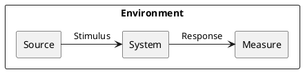

*Stimulus*: condition affecting the system

*Source*: entity generating the stimulus

*Environment*: context under which stimulus occurred (e.g., build, test, deployment, startup, normal operation, overload, failure, attack, change)

*Response*: observable result of the stimulus

*Measure*: benchmark or target value defining a successful response

Pass: 3 scenarios

Good: >3 scenarios

Exceed: >6 scenarios using challenging qualities

}

## Example Scenario

Quality: _Recoverability_

Scenario: In case of power failure, rebooting the system should take up to 20 seconds.

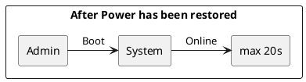

## Scenario 1

Quality: _Time to Market_

{.feedback

- Sounds more like _Time to Market_

}

{.feedback

- Sounds more like _Time to Market_

}

Scenario: The application has to be developed within 6 months

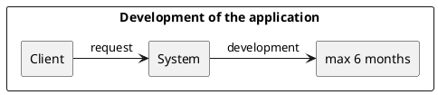

## Scenario 2

Quality: _Design Consistency_

Scenario: Design of the application should be the same on iOS and Android

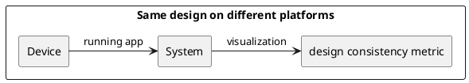

{.feedback

- Is this about the User Interface Design (since you measure the visualization) or the internal software structure design?

}

## Scenario 3

Quality: _Privacy_

Scenario: The location of the user must be encoded before sending it to the RESTful api.

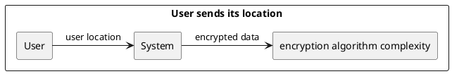

{.feedback

- Environment = Stimulus

}

## Scenario 4

Quality: _Functionality_

{.feedback

- Configurability, Functionality

}

{.feedback

- Configurability, Functionality

}

Scenario: Food truck owner should be able to add a new food truck within 5 minutes

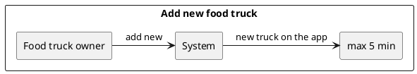

## Scenario 5

Quality: _Robustness_

Scenario: The system checks if the date inserted for a new food truck is valid

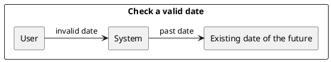

{.feedback

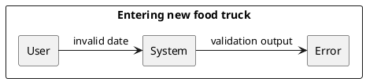

}

## Scenario 6

Quality: _Deployability_

{.feedback

+ Also _Portability_

}

Scenario: The RESTful api should run in a docker container to be executable on every kind of server

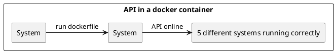

{.feedback

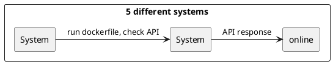

}

## Scenario 7

Quality: _Durability_

{.feedback

- Durability could fit if the scenario involved using old data.
- Why not call it _Backwards Compatibility_ as mentioned in the measure?

}

Scenario: The user will be able to use the application even if he has not upgraded to the last version of the app

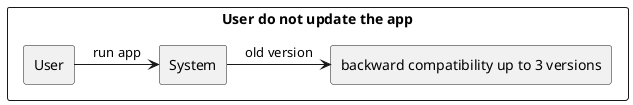


# Ex - Quality Attribute Tradeoff

{.instructions

Pick a free combination of two qualities on the [map](https://usi365.sharepoint.com/:x:/s/MSDE-2022-SoftwareArchitecture/ESVksoXVgMNHtKBKrIwatMYBqorOFaKjxnoqssEy0gNPCg?e=81W7SI) and write your name to claim it.

Then write a short text giving an example for the tradeoff in this assignment.

Pass: 1 unique trade-off

Good: 2 trade-offs

Exceed: >2 trade-offs

}

## Customizability vs. Design Consistency

The customization of the user interface of an application can be useful to match the taste of each user and will increment the user experience. However, the design follows some specific guidelines and you need to be aware of them before making your design incosistent.

## Feasibility vs. Complexity

The feasability of a software is about the economic part and the time to market. More the software is complex the more will cost to produce so the affordability of the software decrease. Also, if a software is more complex to build it will take more time to develop and extend the time to market.

## Complexity vs. Deployability

A more complex software is composed by a big number of components and connections between them. To deploy all the different parts it can require some time and a lot of effort. A less complex software in terms of components will be easier to deploy in production.


# Ex - Feature Modeling

{.instructions

In the context of your chosen project domain, describe your domain using a feature model.

The feature model should be correctly visualized using the following template:


If possible, make use of all modeling constructs.

Pass: Include at least 4 non-trivial features

Good: Include at least 6 non-trivial features, which are all implemented by your project

Exceed: Include more than 8 non-trivial features, indicate which are found in your project and which belong to one competitor

}


Our competitor have feature like putting trucks on favourite or the filtering system based on the typology of the food. However we are the only one implementing the possibility for restaurants to manage their trucks directly on the app.


# Ex - Context Diagram

{.instructions

Prepare a context diagram to define the design boundary for your project.

Here is a PlantUML/C4 example to get started.


Make sure to include all possible user personas and external dependencies you may need.

Pass: 1 User and 1 Dependency

Good: >1 User and >1 Dependency

Exceed: >1 User and >1 Dependency, with both incoming and outgoing dependencies

}


# Ex - Component Model: Top-Down

{.instructions

Within the context of your project domain, represent a model of your modular software architecture decomposed into components.

The number of components in your logical view should be between 6 and 9:

- At least one component should be further decomposed into sub components
- At least one component should already exist. You should plan how to reuse it, by locating it in some software repository and including in your model the exact link to its specification and its price.
- At least one component should be stateful.

The logical view should represent provide/require dependencies that are consistent with the interactions represented in the process view.

The process view should illustrate how the proposed decomposition is used to satisfy the main use case given by your domain model.

You can add additional process views showing how other use cases can be satisfied by the same set of components.

This assignment will focus on modularity-related decisions, we will worry about deployment and the container view later.

Here is a PlantUML example logical view and process view.

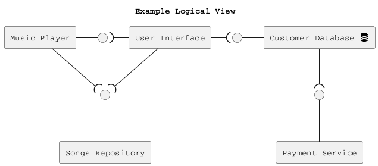

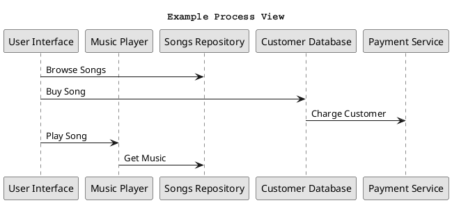

Hint: How to connect sub-components to other external components? Use this pattern.

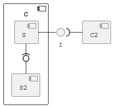

Pass: 6 components (1 decomposed), 1 use case/process view

Good: 6 components (1 decomposed), 2 use case/process view

Exceed: >6 components (>1 decomposed) and >2 use case/process view

}

## Logical View

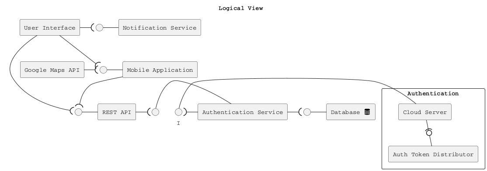


## Process Views

Use Case 1: 

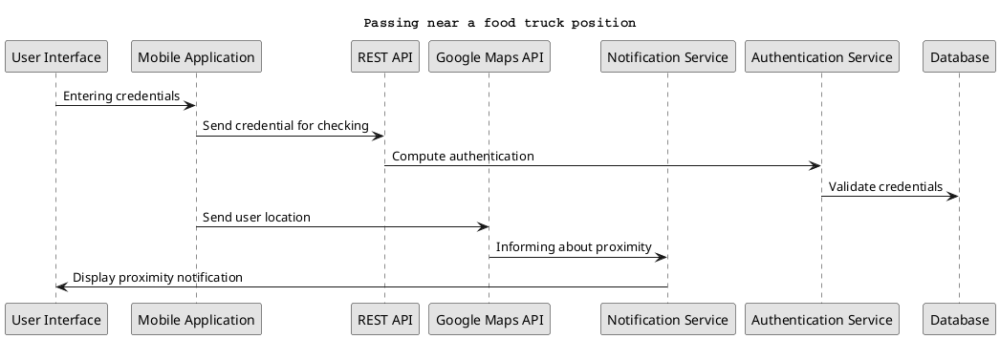

Use Case 2:

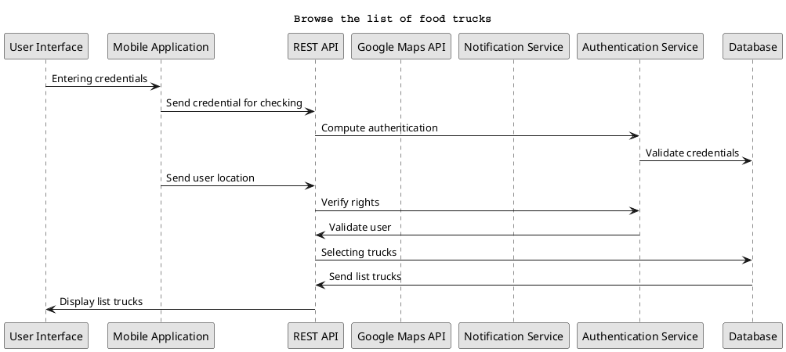

Use Case 3:

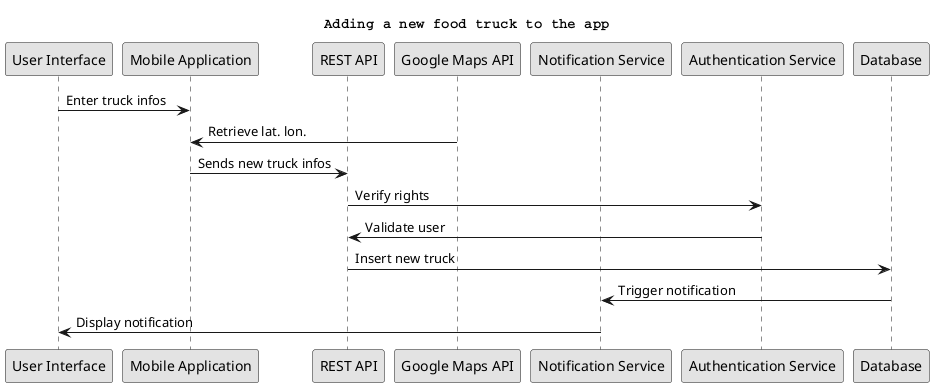


# Ex - Component Model: Bottom-Up

{.instructions

Within the context of your project domain, represent a model of your modular software architecture decomposed into components.

To design this model you should attempt to buy and reuse as many components as possible.

In addition to the logical and process views, you should give a precise list to all sources and prices of the components you have selected to be reused.

Write an ADR to document your component selection process (indicating which alternatives were considered).

Pass: Existing design with at least 1 reused components (1 Logical View, 1 Process View)

Good: Existing design with at least 3 reused components (1 Logical View, 1 Process View, 1 ADR)

Exceed: Redesign based on >3 reused components (1 Logical View, >1 Process View, >1 ADR)

}


# Ex - Interface/API Specification

{.instructions

In this iteration, we will detail your previous model to specify the provided interface of all components based on their interactions found in your existing process views.

1. choose whether to use the top down or bottom up model. If you specify the interfaces of the bottom up model, your interface descriptions should match what the components you reuse already offer.

2. decide which interface elements are operations, properties, or events.

Get started with one of these PlantUML templates, or you can come up with your own notation to describe the interfaces, as long as it includes all the necessary details.

The first template describes separately the provided/required interfaces of each component. 


The second template annotates the logical view with the interface descriptions: less redundant, but needs the logical dependencies to be modeled to show which are the required interfaces.


Pass: define interfaces of all outer-level components

Good: Define interfaces of all outer-level components. Does your architecture publish a Web API? If not, extend it so that it does. 

Exceed: Also, document the Web API using the OpenAPI language. You can use the [OpenAPI-to-Tree](http://api-ace.inf.usi.ch/openapi-to-tree/) tool to visualize the structure of your OpenAPI description.

}

# Ex - Connector View

{.instructions

Extend your existing models introducing the connector view

For every pair of connected components (logical view), pick the most suitable connector. Existing components can play the role of connector, or new connectors may need to be introduced.

Make sure that the interactions shown in the process views reflect the primitives of the selected connector

Pass: model existing connectors based on previous model decisions

Good: model existing connectors based on previous model decisions, write an ADR about the choice of one connector

Exceed: introduce a new type of connector and update your existing process view 
(sequence diagram) to show the connector primitives in action

}

# Ex - Adapters and Coupling

{.instructions

1. Highlight the connectors (or components) in your existing bottom-up design playing the role of adapter. (We suggest to use the bottom-up design since when dealing with externally sourced components, their interfaces can be a source of mismatches).
2. Which kind of mismatch** are they solving?
3. Introduce a wrapper in your architecture to hide one of the previously highlighted adapters
4. Where would standard interfaces play a role in your architecture? Which standards could be relevant in your domain?
5. Explain how one or more pairs of components are coupled according to different coupling facets
6. Provide more details on how each adapter solves the mismatches identified using pseudo-code or the actual code
7. How can you improve your architectural model to minimize coupling between components? (Include a revised logical/connector view with your solution)

Pass: 1-5 (with one adapter)

Good: 1-6 (with at least two adapters)

Exceed: 1-7 (with at least two adapters)

** If you do not find any mismatch in your existing design we suggest to introduce one artificially.

## Hints

* (1) Should we find cases where two components cannot communicate (and are doing it wrongly) and highlight they would need an adapter?, or cases where we have already a "component playing the role of adapter in the view" and highlight only the adapter?

  *Both are fine. We assumed that if you draw a dependency (or a connector) the interfaces match, but if you detect that the components that should communicate cannot communicate then of course introduce an adapter to solve the mismatch*

* (2) Please show the details about the two interfaces which do not match (e.g., names of parameters, object structures) so that it becomes clear why an adapter is needed and what the adapter should do to bridge the mismatch

* (5-6) These questions are about the implications on coupling based on the decisions you documented in the connector view.
  Whenever you have a connector you couple together the components and different connectors will have different forms of coupling

  For example, if you use calls everywhere, do you really need them everywhere? is there some pair of components where you could use a message queue instead?

  Regarding the coupling facets mentioned in question 5. You do not have to answer all questions related to "discovery", "session", "binding", "interaction", "timing", "interface" and "platform" (p.441, Coupling Facets). Just the ones that you think are relevant for your design and by answering them you can get ideas on how to do question 6.

}

# Ex - Physical and Deployment Views

{.instructions

a. Extend your architectural model with the following viewpoints:

1. Physical or Container View

2. Deployment View

Your model should be non-trivial: include more than one physical device/virtual container (or both). Be ready to discuss which connectors are found at the device/container boundaries.

b. Write an ADR about which deployment strategy you plan to adopt. The alternatives to be considered are: big bang, blue/green, shadow, pilot, gradual phase-in, canary, A/B testing.

c. (Optional) Prepare a demo of a basic continuous integration and delivery pipeline for your architectural documentation so that you can obtain a single, integrated PDF with all the viewpoints you have modeled so far. 

For example:

- configure a GitHub webhook to be called whenever you push changes to your documentation
- setup a GitHub action (or similar) to build and publish your documentation on a website

Pass: 1 physical view, 1 deployment view, 1 ADR (b.)

Good: >1 physical view, >1 deployment view, 1 ADR (b.)

Exceed: 1 physical view, 1 deployment view, 1 ADR (b.) + 1 demo (c.)

}

# Ex - Availability and Services

{.instructions 

The goal of this week is to plan how to deliver your software as a service with high availability.

1. If necessary, change your deployment design so that your software is hosted on a server (which could be running as a Cloud VM). Your SaaS architecture should show how your SaaS can be remotely accessed from a client such as a Web browser, or a mobile app
2. Sketch your software as a service pricing model (optional)
3. How would you define the availability requirements in your project domain? For example, what would be your expectation for the duration of planned/unplanned downtimes or the longest response time tolerated by your clients?
4. Which strategy do you adopt to monitor your service's availability? Extend your architecture with a watchdog or a heartbeat monitor and motivate your choice with an ADR.
5. What happens when a stateless component goes down? model a sequence diagram to show what needs to happen to recover one of your critical stateless components
6. How do you plan to recover stateful components? write an ADR about your choice of replication strategy and whether you prefer consistency vs. availability. Also, consider whether event sourcing would help in your context.
7. How do you plan to avoid cascading failures? Be ready to discuss how the connectors (modeled in your connector view) impact the reliability of your architecture.
8. How did you mitigate the impact of your external dependencies being not available? (if applicable)

Pass: 1, 3, 4, one of:  5, 6, 7, 8

Good: 1, 2, 3, 4, two of:  5, 6, 7, 8

Exceed: 1, 2, 3, 4, 5, 6, 7, 8

}

# Ex - Scalability

{.instructions 

Now that your architecture delivers your software as a service, let's redesign it so that it can scale!

1. Pick one scalability dimension: number of clients, size of input, size of state, number of dependencies

2. How well does your architecture scale along the chosen dimension? Where do you expect the bottleneck to be?

3. Modify your architecture to remove the scalability bottleneck you have identified (show both logical, process and deployment view) - consider whether the API/interface of the bottleneck component should be improved.

4. Write an ADR regarding the scalability pattern you have introduced.

5. Write an ADR regarding the issue of component discovery, choosing one of the alternatives: dependency injection vs. directory. Can you identify an existing component playing the role of directory/dependency injection container? Could you give an example of where you would need to add such component to facilitate dynamic component discovery?

Pass: 1, 2, 3, 5

Good: 1, 2, 3, 4, 5

Exceed: 1, 2, 3, 4, 5 then redo 1, 2, 3 for different scalability dimensions

}

# Ex - Flexibility

{.instructions 

Only dead software stops changing. You just received a message from your customer, they have an idea. Is your architecture ready for it?

1. Pick a new use case scenario. Precisely, what exactly do you need to change of your existing architecture so that it can be supported? Model the updated logical/process/deployment views.

2. Pick another use case scenario so that it can be supported without any major architectural change (i.e., while you cannot add new components, it is possible to extend the interface of existing ones or introduce new dependencies). Illustrate with a process view, how your previous design can satisfy the new requirement.

3. Change impact. One of your externally sourced component/Web service API has announced it will introduce a breaking change. What is the impact of such change? How can you control and limit the impact of such change? Update your logical view

4. Open up your architecture so that it can be extended with plugins by its end-users. Where would be a good extension point? Update your logical view and give at least one example of what a plugin would actually do.

5. Assuming you have a centralized deployment with all stateful components storing their state in the same database, propose a strategy to split the monolith into at least two different microservices. Model the new logical/deployment view as well as the interfaces of each microservice you introduce.

Pass: 1, one out of 2-5.

Good: 1, two out of 2-5.

Exceed: 1-5.

}